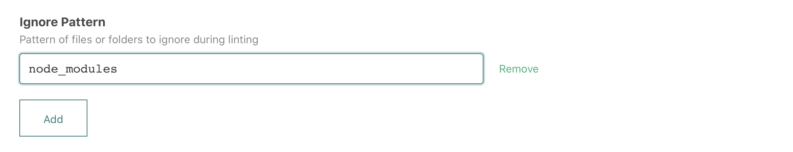
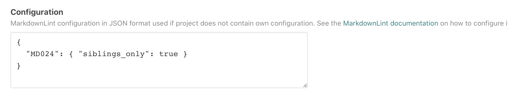
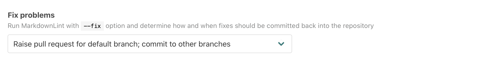
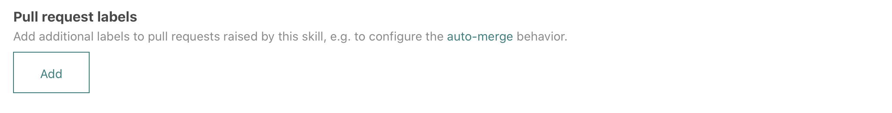

# `atomist/markdownlint-skill`

<!---atomist-skill-description:start--->

Find problems in your Markdown files, get pull requests with fixes

<!---atomist-skill-description:end--->

---

<!---atomist-skill-readme:start--->

# What it's useful for

Get consistency across your Markdown files.

-   Run [MarkdownLint](https://github.com/DavidAnson/markdownlint) with the same
    consistent configuration across all of your projects
-   Also supports repository-specific MarkdownLint configurations
-   Uses GitHub Checks with code-level annotations for linting rule violations
-   Optionally get commits or pull requests with fixes

# Before you get started

Connect and configure these integrations:

1. **GitHub**
1. **Slack or Microsoft Teams**

The **GitHub** integration must be configured in order to use this skill. At
least one repository must be selected. The **Slack** or **Microsoft Teams**
integration is optional.

# How to configure

1. **Select files or folders to ignore**

    

    To speed up linting or avoid linting specific files, select which files and
    folders to ignore.

1. **Specify an optional MarkdownLint configuration in JSON format**

    

    Provide the
    [MarkdownLint configuration](https://github.com/DavidAnson/markdownlint) in
    JSON format to be used for linting when a repository does not have its own
    configuration.

1. **Specify how to apply fixes**

    

    Choose which fix apply option to use or choose not to apply fixes. When a
    fix option is selected, MarkdownLint will be run with the `--fix` option.
    The following options are available:

    - **Raise pull request for default branch; commit to other branches** - with
      this option, fixes on the default branch will be submitted via a pull
      request; fixes on other branches will be committed straight onto the
      branch
    - **Raise pull request for default branch only** - with this option, fixes
      on the default branch will be submitted via a pull request; fixes on other
      branches will not be persisted
    - **Raise pull request for any branch** - with this option, fixes on all
      branches will be submitted via a pull request
    - **Commit to default branch only** - with this option, fixes on the default
      branch will be committed straight to the branch; fixes on other branches
      will not be persisted
    - **Commit to any branch** - with this option, fixes on all branches will be
      committed straight to the branch
    - **Do not apply fixes**

    Pull requests that get raised by this skill will automatically have a
    reviewer assigned based on the person who pushed code. Pull requests that
    are not needed any longer, i.e., because all lint violations were fixed
    manually, are closed automatically.

1. **Configure pull request labels**

    

    Add additional labels to pull requests raised by this skill.

    This is useful to influence how and when the PR should be auto-merged by the
    [Auto-merge Pull Request](https://go.atomist.com/catalog/skills/atomist/github-auto-merge-skill)
    skill.

1. **Determine repository scope**

    

    By default, this skill will be enabled for all repositories in all
    organizations you have connected.

    To restrict the organizations or specific repositories on which the skill
    will run, you can explicitly choose organization(s) and repositories.

# How to lint your Markdown files

1. **Set up the skill by providing an MarkdownLint configuration**

1. **Commit and push your code changes**

1. **Enjoy automatic linting and fixes!**

To create feature requests or bug reports, create an
[issue in the repository for this skill](https://github.com/atomist-skills/markdownlint-skill/issues).
See the [code](https://github.com/atomist-skills/markdownlint-skill) for the
skill.

<!---atomist-skill-readme:end--->

---

Created by [Atomist][atomist]. Need Help? [Join our Slack workspace][slack].

[atomist]: https://atomist.com/ "Atomist - How Teams Deliver Software"
[slack]: https://join.atomist.com/ "Atomist Community Slack"
